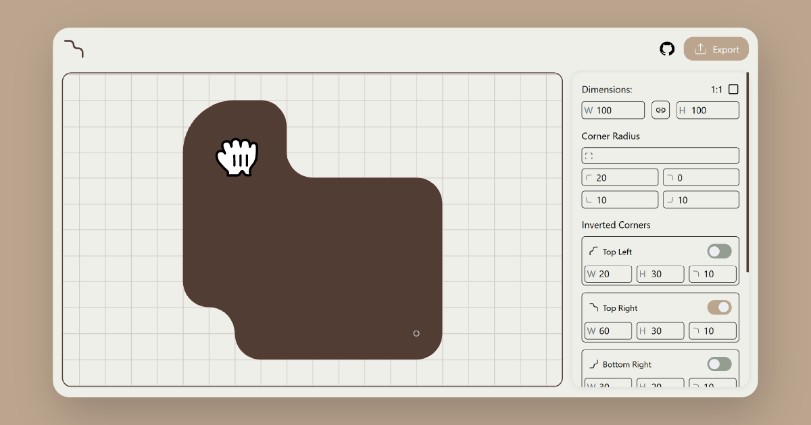

<h1 align="center"><br> Corner Inverter</h1>

A tool to help you generate inverted border radii for you CSS components, powered by SVG path. [try it here!](https://corner-inverter.douiri.org).



## Why do we need this tool

The difficulty of creating such shapes in CSS is the inspiration behind this tool. in contrast to border-radius property, inverted corners need some tricks to work properly which can be time consuming, that's why this tool aims to save you time calculating and getting burned out trying to do it.

So, what creative shapes you can make with it?

## Usage

You can choose which corners to be inverted along with other properties, after finishing you can export your shape as CSS mask, clip-path or SVG.

## How it works

This tool relies on properties like the width, height and radius of each inverted corner to calculate a custom SVG path.

Here's a visual overview:


The resulting SVG path might look like this:

```xml
<path d="M20,0H30A10,10 0,0,1 40,10V20A10,10 0,0,0 50,30H90A10,10 0,0,1 100,40V90A10,10 0,0,1 90,100H30A10,10 0,0,1 20,90V90A10,10 0,0,0 10,80H10A10,10 0,0,1 0,70V20A20,20 0,0,1 20,0Z" />
```

This path uses a limited set of SVG commands to build the shape:

| Command | Meaning                     |
| ------- | --------------------------- |
| M       | Move to a starting point    |
| H       | Draw Horizontal Line        |
| V       | Draw vertical Line          |
| A       | Draw arc for curved corners |
| Z       | Close the path              |

> The arcs (`A`) are what create the smooth inverted corners.

## CSS Limitations

- Using `path()` inside a clip-path isn't responsive. Since it doesn't accept relative values, you're stuck with exact dimensions.
- With the `mask` property it will work fine as long as the aspect ratio of your element matches the aspect ratio specified in the tool. to make sure your element's aspect ratio stays the same in CSS use the `aspect-ratio` property.
